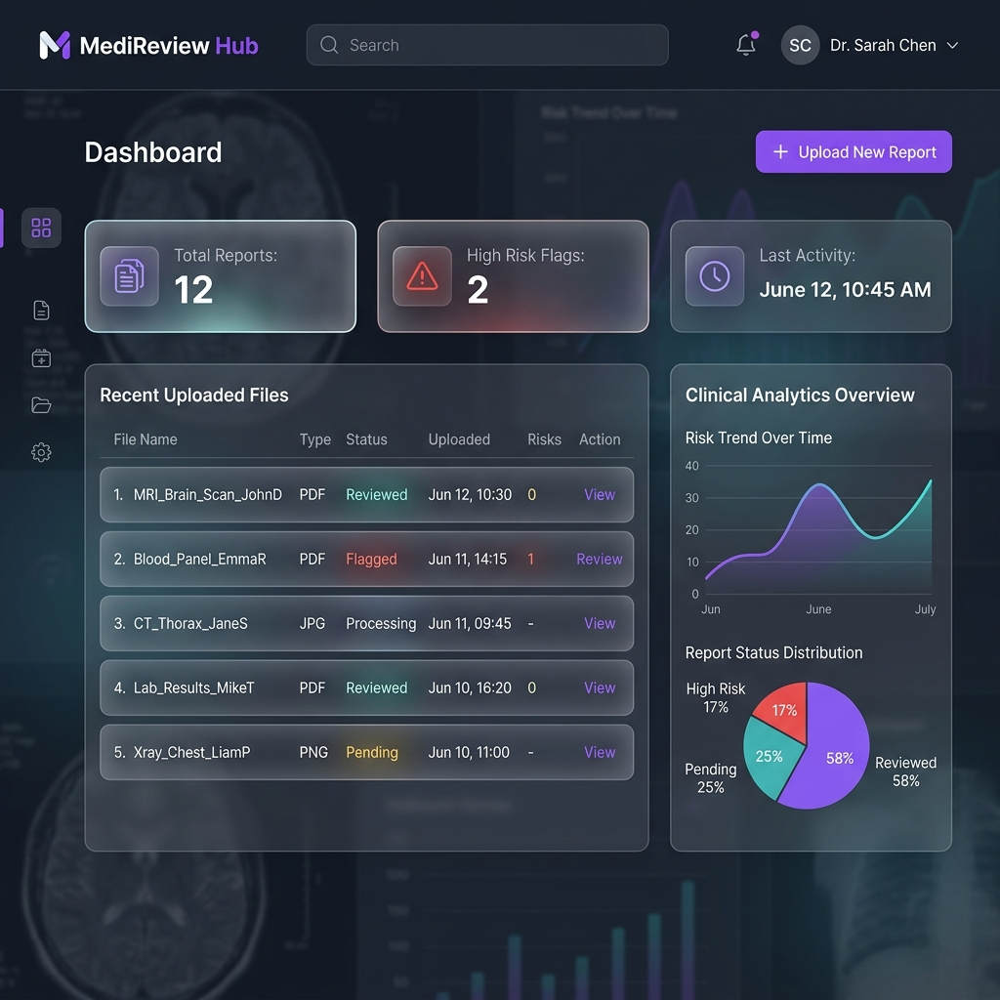

# 🏥 Medical Report Reviewer

> An AI-powered full-stack web application that helps patients understand their medical reports in plain language — across multiple languages.

---

## ✨ Features

- 📄 **Upload PDF or image** medical reports (blood reports, lab results, etc.)
- 🔍 **OCR text extraction** from scanned image reports using Tesseract.js
- 🤖 **AI-powered analysis** via Google Gemini — generates plain-language summaries, explains abnormal findings, and suggests follow-up actions
- 🌍 **Multi-language support** — AI responses in the user's preferred language (English, Hindi, Gujarati, etc.)
- 📊 **Risk level classification** — Low / Medium / High with visual indicators
- ☁️ **Cloud storage** — Reports stored securely on Cloudinary
- 🔐 **Secure authentication** — JWT via HTTP-only cookies + Google OAuth 2.0
- 🛡️ **Token blacklisting** — Secure stateless logout
- ⚡ **Rate limiting** — Brute-force protection on auth endpoints

---

## 🛠️ Tech Stack

| Layer | Technology |
|-------|------------|
| **Frontend** | React 19, Vite, TailwindCSS v4, React Query v5 |
| **Backend** | Node.js, Express 5, MongoDB, Mongoose |
| **AI** | Google Gemini API (`@google/genai`) |
| **OCR** | Tesseract.js, pdf-parse |
| **Storage** | Cloudinary |
| **Auth** | JWT (HTTP-only cookies), Google OAuth 2.0 |
| **Validation** | Zod |
| **Logging** | Winston |
| **Security** | express-rate-limit, bcryptjs, token blacklist |

---

## 🏗️ Architecture

```
frontend/          # React + Vite SPA
├── src/
│   ├── pages/     # Route-level page components
│   ├── components/ # Reusable UI components
│   ├── hooks/     # React Query data-fetching hooks
│   ├── context/   # Auth & Theme context providers
│   └── api/       # Axios API client

backend/           # Node.js + Express REST API
├── controllers/   # Request handlers
├── services/      # Business logic (AI, OCR, normalization)
├── models/        # Mongoose schemas
├── routes/        # Express route definitions
├── middleware/     # Auth, validation, file upload
├── validators/    # Zod schemas
└── utils/         # Logger, token, prompt builder
```

---

## 📸 Screenshots



---

## 🚀 Getting Started

### Prerequisites
- Node.js 18+
- MongoDB Atlas account
- Google Cloud project (for Gemini API + OAuth)
- Cloudinary account

### 1. Clone the repository
```bash
git clone https://github.com/YOUR_USERNAME/medical-report-reviewer.git
cd medical-report-reviewer
```

### 2. Setup the backend
```bash
cd backend
npm install
cp .env.example .env   # Fill in your environment variables
npm start              # Starts with nodemon
```

### 3. Setup the frontend
```bash
cd frontend
npm install
npm run dev
```

The app will be available at `http://localhost:5173`.

---

## 🔑 Environment Variables

Create `backend/.env` based on `backend/.env.example`:

```env
PORT=5000
NODE_ENV=development

MONGODB_URI=mongodb+srv://<user>:<password>@cluster.mongodb.net/medical-reports

JWT_SECRET=your_super_secret_jwt_key

GEMINI_API_KEY=your_google_gemini_api_key

CLOUDINARY_CLOUD_NAME=your_cloud_name
CLOUDINARY_API_KEY=your_api_key
CLOUDINARY_API_SECRET=your_api_secret

GOOGLE_CLIENT_ID=your_google_client_id
GOOGLE_CLIENT_SECRET=your_google_client_secret
GOOGLE_REDIRECT_URI=http://localhost:5000/api/auth/google/callback

FRONTEND_URL=http://localhost:5173
```

---

## 🧪 Running Tests

```bash
cd backend
npm test
```

Tests cover the core report normalization logic with multiple scenarios (normal, HIGH, LOW, edge cases).

---

## 📡 API Endpoints

### Auth
| Method | Endpoint | Description |
|--------|----------|-------------|
| POST | `/api/auth/signup` | Register a new user |
| POST | `/api/auth/login` | Login with email/password |
| POST | `/api/auth/logout` | Logout (blacklists JWT) |
| GET | `/api/auth/me` | Get current authenticated user |
| GET | `/api/auth/google` | Initiate Google OAuth |
| GET | `/api/auth/google/callback` | Google OAuth callback |

### Reports
| Method | Endpoint | Description |
|--------|----------|-------------|
| POST | `/api/upload_report` | Upload a PDF/image report |
| POST | `/api/analyze_report` | Trigger AI analysis on a report |
| GET | `/api/reports` | Get all reports for the user |
| GET | `/api/report/:reportId` | Get a specific report |

### User
| Method | Endpoint | Description |
|--------|----------|-------------|
| GET | `/api/user/profile` | Get user profile |
| PUT | `/api/user/edit` | Update profile (name, email, language) |

---

## 🔒 Security

- Passwords hashed with **bcryptjs** (10 salt rounds)
- JWT stored in **HTTP-only cookies** (XSS resistant)
- **Token blacklisting** on logout prevents token reuse
- **Rate limiting** — 20 requests/15min on auth, 100 requests/15min on API routes
- **Zod validation** on all input before hitting controllers
- **CORS** restricted to `FRONTEND_URL` environment variable

---

## 📄 License

MIT — feel free to use this project as a reference or starting point.
